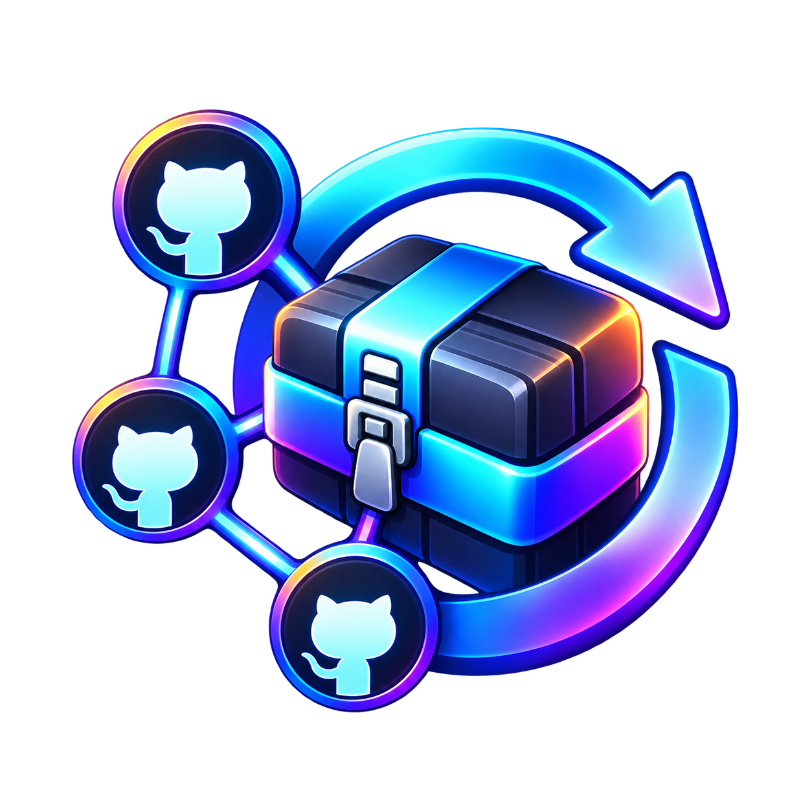

# GitHub Plugin Updater



**Decky plugin for SteamOS and Bazzite:** Reads `repos.txt`, checks GitHub releases, and automatically installs new plugins or newer versions.

**Language:** [Deutsch](README.md) · [English](README_EN.md)

## Features

- Reads repositories exclusively from `repos.txt`: one GitHub URL or `owner/repo` per line. No need to enter links individually in the plugin UI.
- Finds uploaded plugin ZIP assets in published GitHub releases. GitHub's auto-generated source archives are not used as plugin ZIPs.
- Installs plugins that are missing and replaces older installed versions; up-to-date versions are skipped.
- Matches installations by repository, plugin folder, and plugin name. For differing names, use **Repositories → Zuordnen** in the UI to associate an existing installation manually.
- Shows a progress bar with the current repository, step, elapsed time, and transferred data during downloads when available.
- Backs up the previous version, extracts updates into Decky's plugin directory, and restarts Decky Loader and the Steam UI afterward.
- Also checks automatically about every 24 hours while Decky is running.

## Installation

1. Download and extract the supplied `github-plugin-updater-v1.5.1.zip`.
2. Copy its `github-plugin-updater` folder into `~/homebrew/plugins/`. For upgrades, replace the existing folder rather than creating another installation with a different name.
3. Restart Decky Loader or the device. Under **Import**, you should see **Backend v1.5.1**.

The plugin uses Decky's `root` flag because automatic installation requires write access to the plugin directory. Only follow GitHub repositories and release ZIPs you trust.

## Set up `repos.txt`

Create `repos.txt` in your Downloads folder. The plugin checks the configured XDG Downloads folder, `~/Downloads`, `/home/deck/Downloads`, and `/home/bazzite/Downloads`. The first file found takes precedence.

```text
# One repository per line
https://github.com/Steamdeckchecker/SDC-Benchmark-
https://github.com/Hooandee/panel-de-control/releases
Ciphay/Decky-File-Manager
```

Blank lines and lines beginning with `#` are ignored. Both `owner/repo` and URLs ending in `/releases` work. The file holds your **complete** monitored list. Removing a line and reloading the file stops monitoring that repository; it does not uninstall an already installed plugin.

The file is read at startup, before every update check, and through **Import → repos.txt öffnen → repos.txt neu einlesen**. If it is missing, the saved list is retained; an update check reports the missing file path and installs nothing.

## Check for updates

1. In Decky, select **GitHub Updates → Updates prüfen**.
2. Follow the current repository, step, and progress. The percentage may pause while GitHub responds; elapsed time keeps running.
3. View the results and any error messages in the plugin. The Steam UI briefly restarts after successful installations.

A release ZIP must contain a built Decky plugin with `plugin.json`, `package.json`, `main.py`, and `dist/index.js`. Its display name may differ from the GitHub repository name. Versions, archive sizes, and archive paths are checked before installation. Old installations are stored under `~/homebrew/data/github-plugin-updater/backups/`; downloaded ZIPs go to `~/Downloads`.

When the GitHub API rate limit is reached, the plugin tries the public releases page. After a Python TLS handshake error, it can also retry with system `curl` while still verifying certificates. Real network failures and denied downloads can still prevent updates.

## Development

Run `pnpm install` and `pnpm run build` in the source directory to produce `dist/index.js`. The installable ZIP must already contain this file; Node.js is not needed on the Steam Deck.
